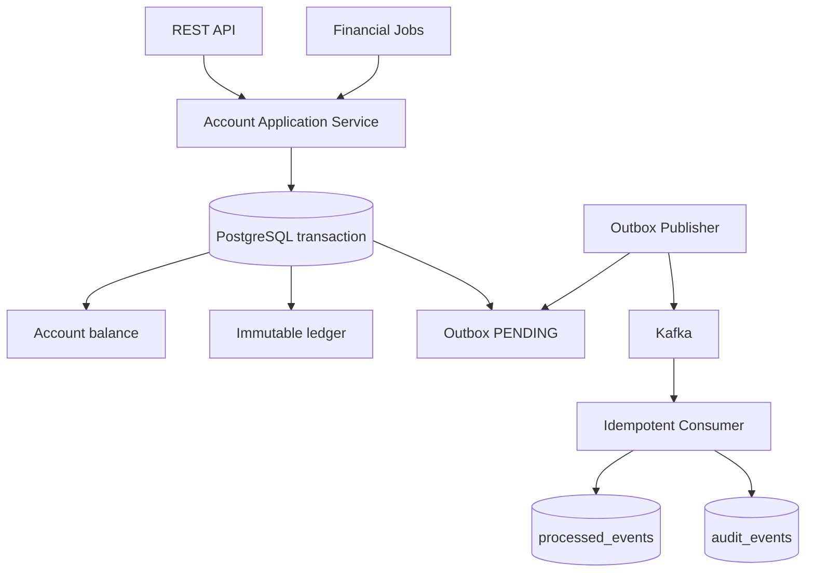

# Banking Ledger MVP

MVP bancário em Java 21/Spring Boot com visão contábil, saldo transacional, histórico de lançamentos, jobs financeiros, Transactional Outbox e consumidores idempotentes.

## Arquitetura



Toda movimentação grava, na mesma transação:

1. o novo saldo da conta com lock pessimista;
2. um lançamento imutável no ledger;
3. um evento técnico na Outbox.

O publicador marca o evento como `PROCESSING`, publica no Kafka e então altera para `COMPLETED`. Falhas ficam como `FAILED` e são reprocessadas. Como Kafka trabalha normalmente com entrega *at-least-once*, o consumidor usa `eventId` como chave única em `processed_events`.

## Funcionalidades

- criação e consulta de conta;
- crédito e débito com chave de idempotência;
- extrato/auditoria de lançamentos;
- apropriação diária de juros;
- cobrança mensal de tarifa;
- aplicação e resgate simplificados;
- reconciliação entre saldo e ledger;
- Outbox com retentativas;
- consumidor Kafka idempotente;
- PostgreSQL, Kafka e Kafka UI via Docker Compose.

## Executar

Requisitos: Java 21, Maven 3.9+ e Docker.

```bash
docker compose up -d
mvn spring-boot:run
```

Swagger: `http://localhost:8080/swagger-ui.html`  
Kafka UI: `http://localhost:8081`

## Exemplos

```bash
curl -X POST http://localhost:8080/api/accounts \
  -H 'Content-Type: application/json' \
  -d '{"customerId":"11111111-1111-1111-1111-111111111111","type":"CHECKING"}'

curl -X POST http://localhost:8080/api/accounts/{accountId}/transactions \
  -H 'Content-Type: application/json' \
  -H 'Idempotency-Key: credito-001' \
  -d '{"type":"CREDIT","amount":1000.00,"description":"Aporte inicial"}'
```

## Decisões importantes

- Dinheiro usa `BigDecimal` e moeda explícita.
- O saldo é uma projeção rápida; o ledger é a trilha de auditoria.
- Débitos nunca deixam saldo negativo neste MVP.
- Jobs chamam o mesmo caso de uso das APIs, sem alterar saldo diretamente.
- O `eventId` é preservado em todas as reentregas.
- Em produção, recomenda-se Debezium/CDC para publicar Outbox, DLQ, métricas, TLS/SASL no Kafka e mTLS entre serviços.

